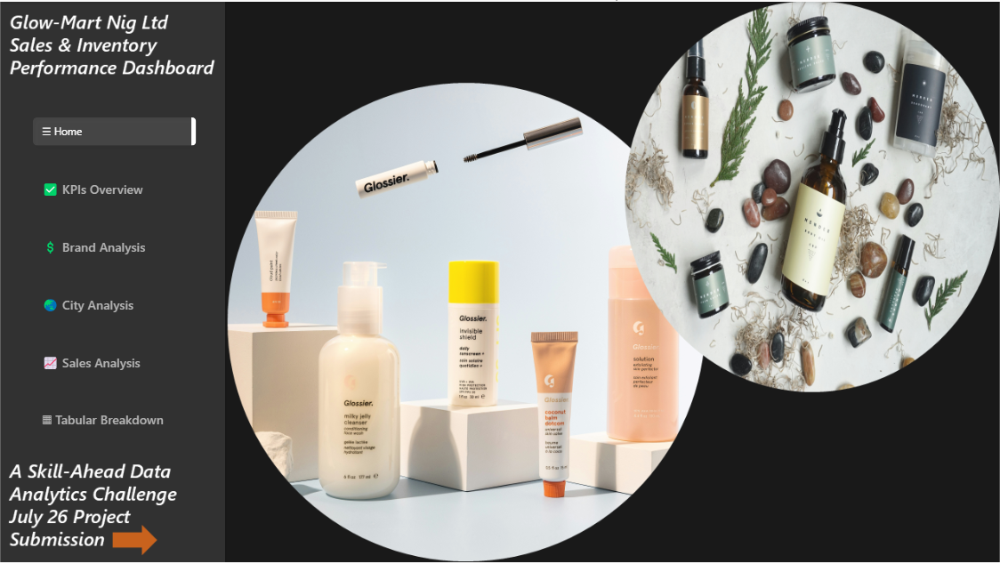
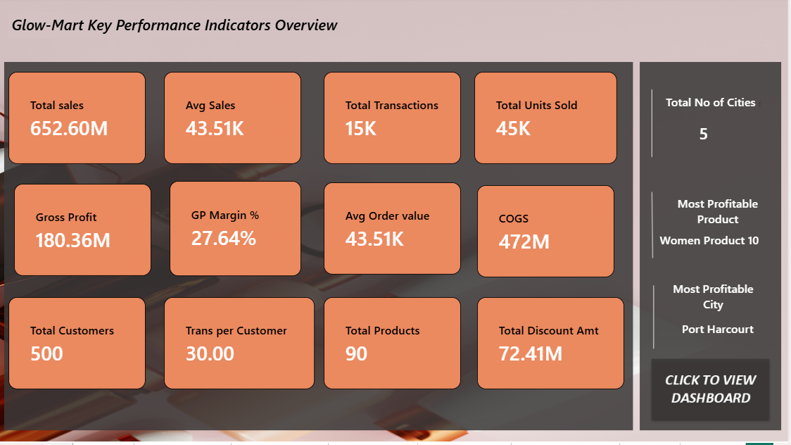
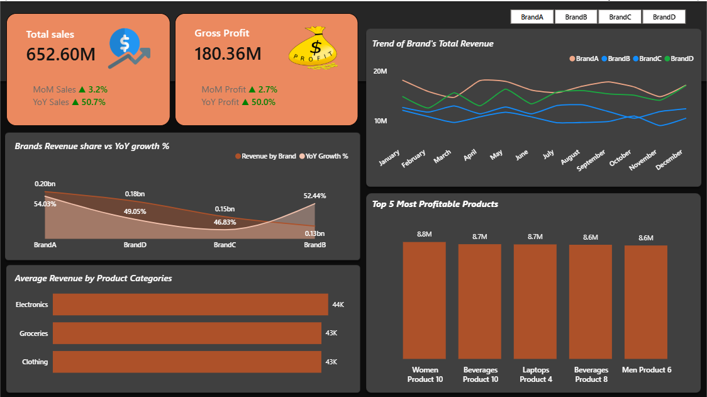
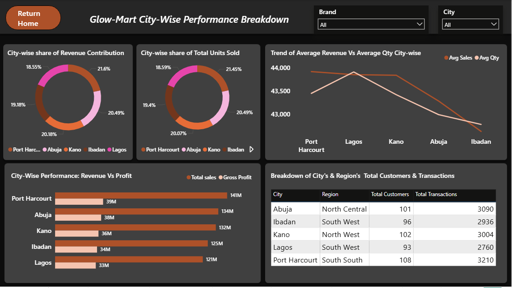
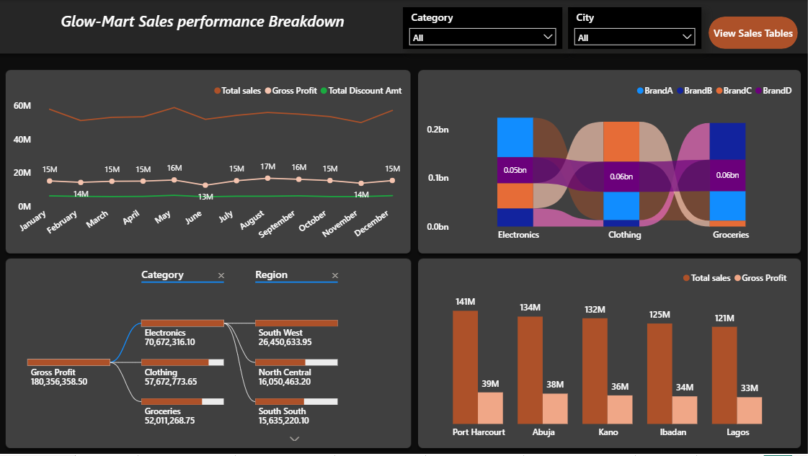
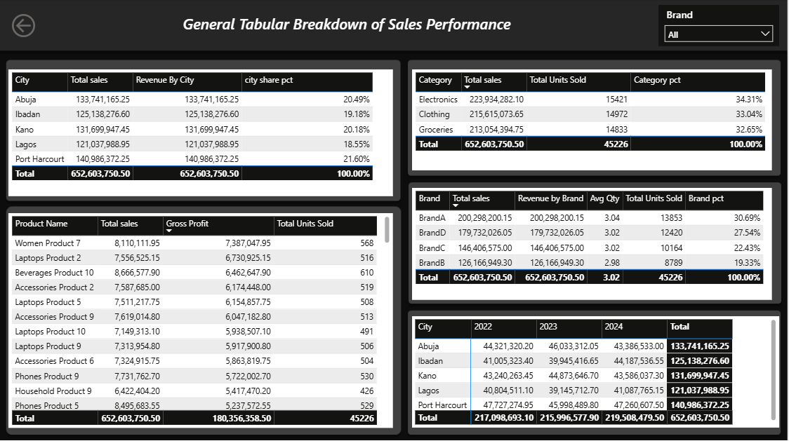

## Stock Sales & Inventory Performance Analysis \| Revenue, Trends and Insights

GlowMart Nigeria Ltd \| Power BI Project \| Retail Sales Data \| FMCG Beauty & Personal Care \| From Raw Data to Business Insights

<br>

## 📚 Table of Contents

-   [Project Overview](project-overview)
-   [Business Objective](business-objective)
-   [Tools & Technologies](tools-technologies)
-   [Dataset Overview](dataset-overview)
-   [Dax Measures](data-cleaning-process)
-   [Power BI Dashboard](power-bi-dashboard)
-   [Findings](key-insights)
-   [Recommendations](recommendations)

<br>

### Project Overview {#project-overview}

#### The Business Scenario

Company In Focus: GlowMart Nigeria Ltd GlowMart Nigeria Ltd is a mid-size FMCG beauty and personal care retailer with 500 customers, 90 products across 4 brands, and operations in Lagos, Abuja, Kano, Ibadan, and Port Harcourt. The company has recorded 15,000 transactions between 2022 and 2024.

The Conflict:

> Emeka Okafor (Sales Manager): "My team is losing sales because Inventory is not stocking the right products in the right cities. Port Harcourt and Kano customers are ready to buy, but the shelves are empty."

> Tunde Adeyemi (Inventory Manager): "I stock based on what Sales tells me to plan for. Nobody gave me updated numbers. My records show equal allocation across all five cities, show me the data."

> The MD, (Mrs. Chidinma Eze): stepped in and commissioned the Head of BI & Data Analytics to build a single dashboard that resolves this conflict with evidence, and guides future inventory allocation decisions.

<br>

### Dataset Overview {#dataset-overview}

The dataset provided contains four related tables that must be connected in a star-schema data model:

| Table | Primary Key | Role | Key Columns |
|------------------|------------------|------------------|------------------|
| Sales (Fact) | SalesID | All transactions | CustomerID, ProductID, OrderDate, Quantity, Unit Price, Discount, Total Sales |
| Customers | CustomerID | who bought | City, Region, Gender, Age Group |
| Products | ProductID | What was bought | Brand, Cost Price (90 products, 4 brands) |
| Date | Date | Time intelligence | Year, Month, Quarter, Day of Week |

`NB: Data covers: 500 customers · 90 products · 4 brands · 5 cities · 15,000 transactions · Price range NGN 1,000 – NGN 20,000 · Discount 0% – 20% · 1 – 5 units per order.`

<br>

### Business Objective {#business-objective}

Using the dataset provided, build a professional analytics solution that:

-   Connects the four tables in a correct data model (star schema)
-   Calculates the required KPIs and metrics
-   Presents the findings in a clean, well-designed dashboard or report
-   Resolves the Sales vs. Inventory conflict with data-backed evidence
-   Provides at least three business recommendations supported by the analysis

<br>

### Tools & Technologies {#tools-technologies}

-   Microsoft power BI: will be used as the major BI tool for the ETL (Extraction, Transformation & Loading) of our dataset as well as the tool for data visualizations.
-   Power Point: we used ppt to create our dashboard placeholders to give us nicer looking dashboard , we avoided creating our BG/placeholders in power BI as it will increase our file size & load-time when the pbix file/project is opened.

<br>

### Dax Measures

<br>

| S/n | KPI / Metric | Business Question Answered | Category |
|------------------|------------------|------------------|------------------|
| 01 | Total Revenue | How much did GlowMart earn across all cities and brands ? | Core Revenue |
| 02 | Gross Profit & GP Margin % | Are we making enough profit after cost of goods? | Profitability |
| 03 | Total Transactions | How many orders were placed, and is frequency growing ? | Volume |
| 04 | Avg Order Value (AOV) | How much does a single customer spend per visit ? | Efficiency |
| 05 | Total Units Sold | How many product units moved across all transactions? | Volume |
| 06 | Revenue by City | Which city drives the most revenue, and deserves more stock ? | Geographic |
| 07 | Revenue by Brand | Which brand is the strongest performer by city? | Brand |
| 08 | Total Discount Amount | How much revenue was given away through discounts? | Discount |
| 09 | YoY Revenue Growth % | Is the business growing year-onyear? | Growth |
| 10 | Transactions per Customer | How frequently do customers return to buy? | Loyalty |
| 11 | Revenue per Customer | What is the average 3-year value of one customer? | Customer |

<br>

The above Dax measures are thus computed in power as thus:

``` html

Total sales = SUMX('Sales', 
'Sales'[Quantity] * 'Sales'[Unit Price] * (1- 'Sales'[Discount]))
```

``` html

Gross profit  = 

Var Total_sales = [Total Sales]

Var COGS = SUMX('Sales', 
'Sales'[Quantity] * RELATED('Products'[Cost Price])
)

Var Profit = Total_sales - COGS

Return 
    Profit
```

``` html
GP Margin % =

Var Total_sales = SUMX('Sales', 
'Sales'[Quantity] * 'Sales'[Unit Price] * (1- 'Sales'[Discount]))


Var Gross_profit = [Gross Profit]


Var margin = DIVIDE(
    Gross_profit, 
     Total_sales, 0)

Return 
    margin
```

``` html

Total Transactions = COUNTROWS('Sales')
```

``` html

Avg Order value = 
 DIVIDE([Total sales], [Total Transactions],0)
```

``` html

Total Units Sold = 
SUM('Sales'[Quantity])
```

``` html
Revenue by City = CALCULATE(
[Total Sales], ALLEXCEPT(Customers, Customers[City]) )

-- Or use as a measure with City on visual axis: Revenue by City =
CALCULATE([Total Sales])
```

``` html

Revenue by Brand = CALCULATE(
[Total Sales], ALLEXCEPT(Products, Products[Brand]) ) 
```

``` html

Brand Revenue Share %  = DIVIDE(
[Total Sales],
CALCULATE([Total Sales], ALL(Products)), 0
)
```

``` html

Total Discount Amount = SUMX(
Sales, (Sales[Unit Price] * Sales[Quantity]) - Sales[Total Sales] )

-- Discount Rate %: Avg Discount Rate % = AVERAGE(Sales[Discount])
```

``` html

Total Discount Amount = SUMX(
Sales, (Sales[Unit Price] * Sales[Quantity]) - Sales[Total Sales] )

-- Discount Rate %: Avg Discount Rate % = AVERAGE(Sales[Discount])
```

``` html

YoY Growth % = 

VAR currentyaer = [Total sales] 

VAR Lastyear = CALCULATE([Total sales], SAMEPERIODLASTYEAR('Date'[Date]))

Return 
DIVIDE(currentyaer - Lastyear, Lastyear, BLANK())
```

``` html

Transactions per Customer = DIVIDE(
[Total Transactions],
DISTINCTCOUNT(Sales[CustomerID]), 0
)
```

``` html

Revenue per Customer = DIVIDE(
[Total Sales],
DISTINCTCOUNT(Sales[CustomerID]), 0
)
```

<br>

### Power BI Dashboard {#power-bi-dashboard}

<br>

After creating and/or computing for all the various Dax measures required to solve or gather insights. The next thing was the creation of placeholders in power point , saving/exporting them as png files and loading them into our Bi environment.

Our Dashboard is a comprehensive dashboard that covers these core areas that targeted uncovering insights by having sub-pages/tabs , viz:

#### Key Tabs Include:

-   📊 **Home**: A single welcome/landing page

    

-   🎯**KPIs Overview**: That presents via cards all important KPIs

    

-   💡 **Brand Analysis**: a tab/page for visuals covering firm's brands of collection

    

-   🧮 **City Analysis**: covering visuals that are geared towards uncovering insights city/location wise

    \
    

-   📈 **Sales Analysis**:The displays visuals that speaks to sales vs profit of brands, cities as well as their respective net conribution.

    

-   🌡️ **Tabular Breakdown**: That depicts major tabular breakdown of sales vs profit etc

    \

    <br>

    The dashboard allows **filtering by various slicers**, viewing sales performance across categories brands, exploring trends, profit vs sales cities across in just a few clicks.


<br>

### Findings

<br>

1.  Our topmost performing brands are (BrandA & BrandD). Under the brand analysis, we discovered that Brand-B is performing below the threshold of 20% with its Brand pct of 19% .

2.  The Port-Harcourt location/city brings in the highest net contribution to the company followed closely by Abuja and Kano.

3.  From our analysis, it was discovered that Electronics performed and/or brought in the highest share of revenue to the company, followed by clothing in terms of product category profitability.

4.  From the discount amount analysis, we are expending on the average 10.2 % on promotional campaigns for our two-least profitable brands (BrandB & BrandC), especially the least performing brand. while at the same time spending below 9.98% on our top performing brands ( BrandD & BrandA ). In addition, we can infer based on this metric ( Total Units sold ) that discount have a correlation on sales volume (Total transactions).

5.  In terms of product profitability: the following are the top 5 performing products across our cities/location;

-   Women product 7
-   Laptops product 2
-   Beverages product 10
-   Accessories product 2
-   Laptops product 5

6.  Based on the YoY growth % analysis, from the given time periods (2003 , 2004, 2005 ) : we had negative or declining revenue growth for the year 2004 ( -0.51%), but our revenue was flat by (1.63 %) in the year 2005. which indicate we can perform better however (been at the 0- 2% threshold) its not a positive indicator of growing revenue base.

<br>

### Recommendations {#recommendations}

<br>

1.  Based on Revenue/sales and profitability margins, Port Harcourt, Abuja & Kano Locations should receive priority stocks as well as larger share of the company total stocks, i.e they should receive the highest stock allocations.

2.  Based on our brand performance analysis, its recommended that there should be a re-priotization of the company's SKU (stock Keeping Unit), especially in regards to our lowest performing brand(BrandB) via more marketing campaigns and/or gradual phasing out its collections.

3.  Based on the core conflict issue that prompted this analysis project(i.e the issue between the Sales Manager Vs Inventory manager, its recommended that a system that fosters close synergy & integration between the two departments should be put in place such as the: Joint-performance-Account : that houses/have spreadsheet columns of key metrics of both depts so that stock vs sales performance across cities/locations; products will be easily captured and monitored for timely assessment, re-stocking and planning. Such spreadsheet should contains columns such as these:

<br>

`| Date | Weekly-sales | Monthly-sales | Quartely Sales | Units sold | city |  Brand | Products | Category| Current-stock levels | Last-order Date | Location-stock-levels | Total Stcok Levels |`

------------------------------------------------------------------------

### Acknowledgement:

<br>

This Data analysis project was initially midwifed by Coach Anietie of the Skill-head Tech Learning Platform/Data Academy titled : Data Analytics Challenge July 2026. I took initiative to participate and proffer solutions to the business problem aforementioned in this project. My special thanks goes to Coach Anietie for this challenge, the business brief-cum-resources provided was so pivotal in deriving important insights to this project.

------------------------------------------------------------------------

<br>


------------------------------------------------------------------------
